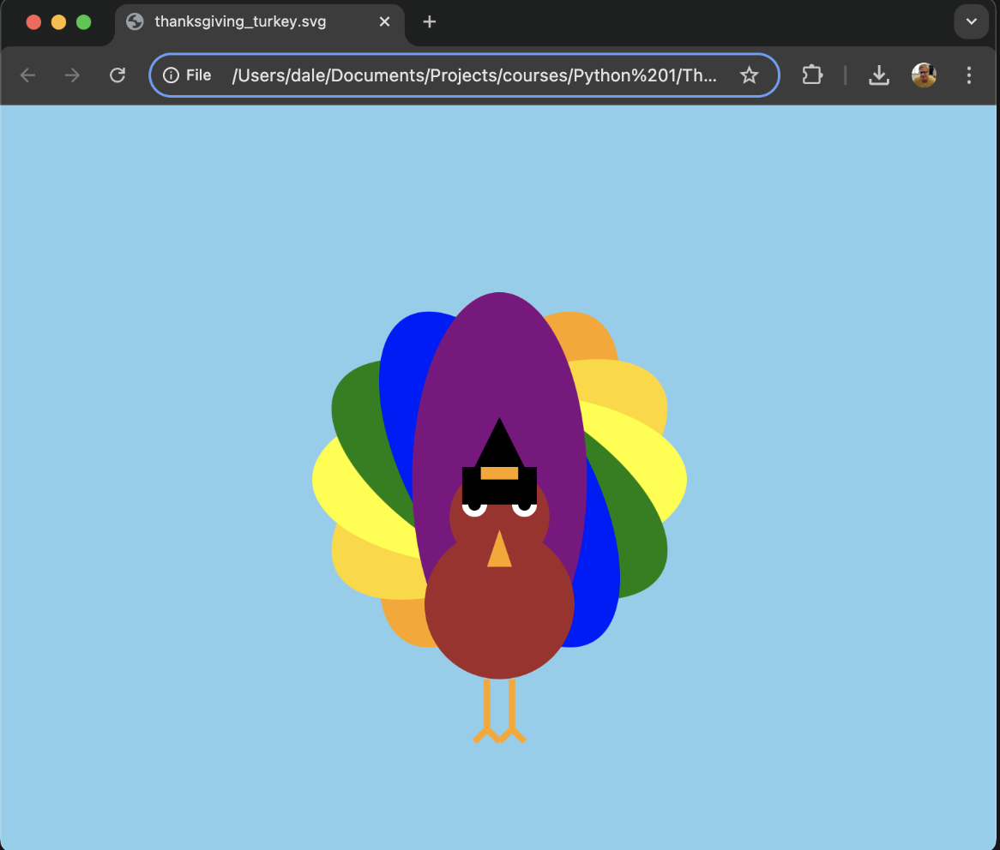

<h1>Introduction</h1>
SVG (Scalable Vector Graphics) is a resolution-independent, XML-based format for creating two-dimensional graphics. This tutorial will teach you how to design a sunset scene with SVG.

With an SVG, you can create a cool image like the attached Thanksgiving turkey that Dale Musser made.

[Previous: Home](README.md) | [Next: Tools and Setup](tools-and-setup.md)

